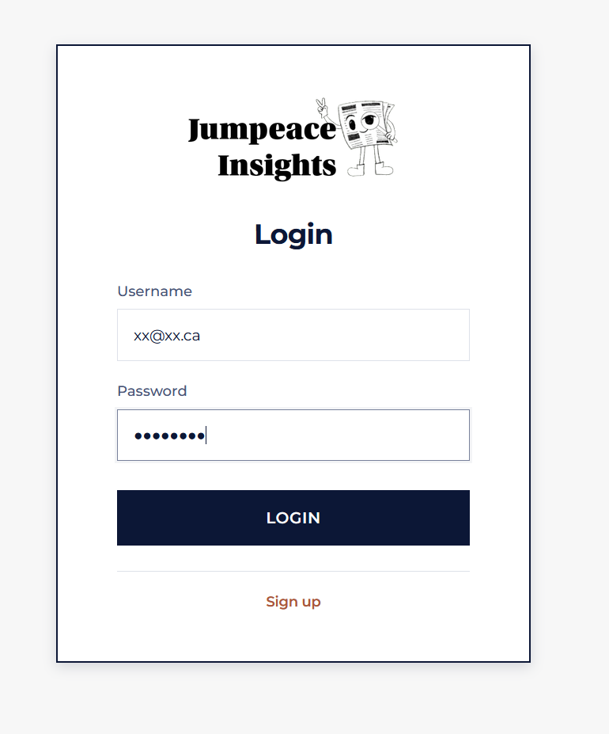
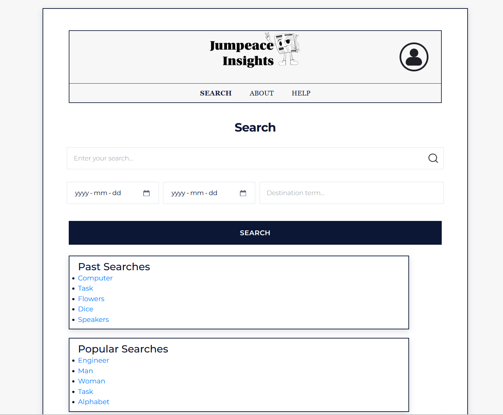
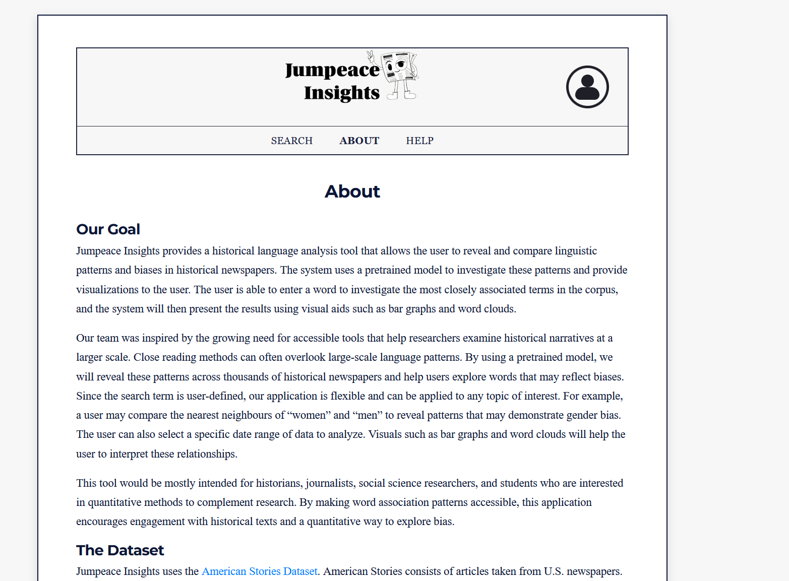
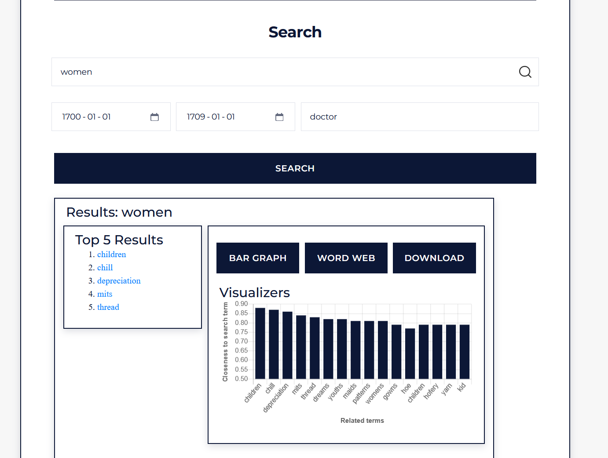
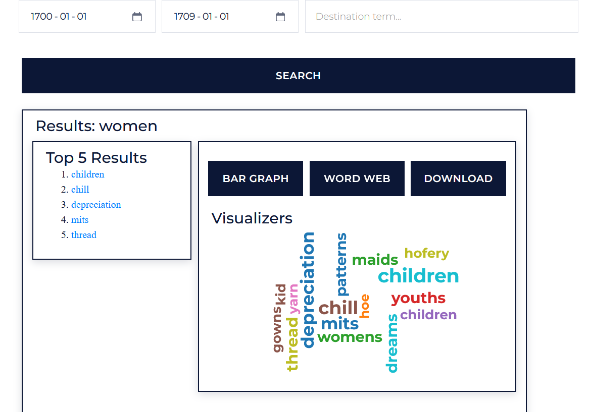
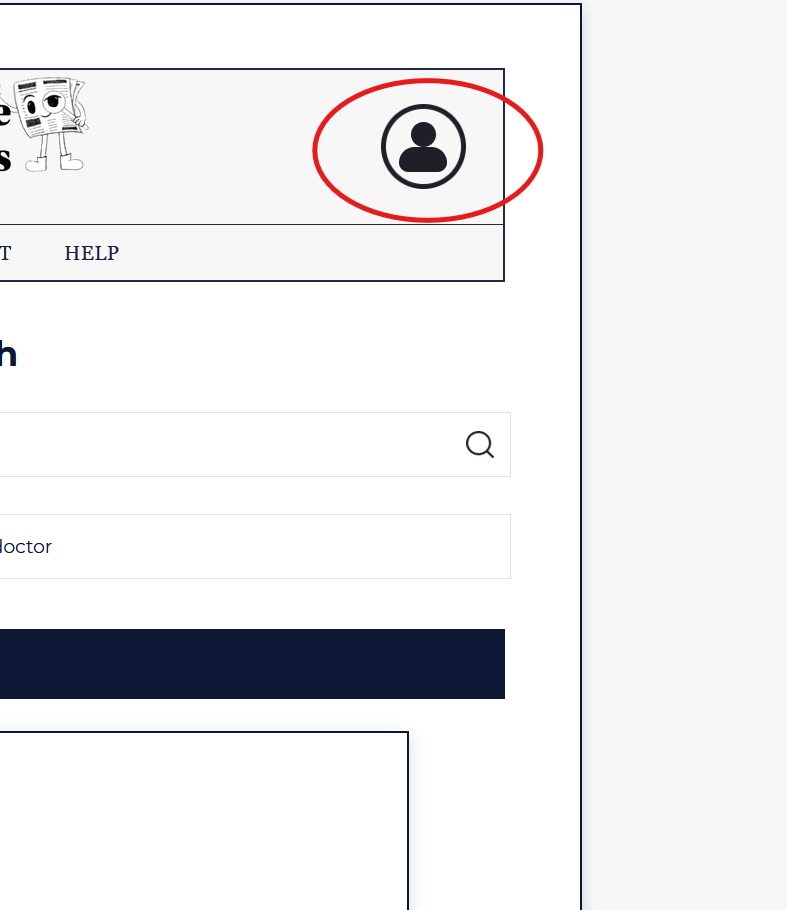
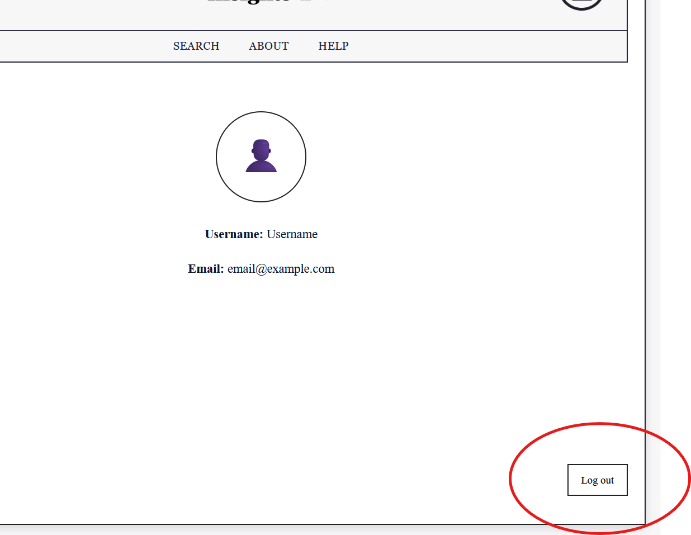

# Lab 4 High Fidelity Prototype Demo
- Please have npm and webpack downloaded and installed.
- If later version of webpack installed, run:
cd src\templates\static; npm install webpack-cli@3.3.2 --save-dev

## To Open Webpage
- Run: cd src/templates/static; $env:NODE_OPTIONS="--openssl-legacy-provider"; npm run build
- cd ../../
- From project-setup-jumpeace_g3\src>, run: python run.py
  - Sample Output:
```
    WARNING: This is a development server. Do not use it in a production deployment. Use a production WSGI server instead.
     * Running on http://122.1.0.1:4230
    Press CTRL+C to quit
     * Restarting with stat
     * Debugger is active!
     * Debugger PIN: 123-156-637
```
- Click on http://122.1.0.1:4230, and it should bring you to the login page.
- Login with dummy user (email: xxx@xx.ca) and password (8 characters), and the tasks will show.

## Key User Walkthroughs

#### Assumptions
- Our database only scans from 1700-01-01 to 1709-01-01.
- Results are only for women.
- Destination Term will show up regardless of closeness, in production.

### Key User Walkthrough #1
For our first use case, the new user wants to know more about our application. After learning more using the help/about pages, they check out a popular search.

## Demo Screenshots

### Login Page


### Search Page


### About Page


### Key User Walkthrough #2
For our second use case, the returning user will search for the term "women" in the date range of 1770-1779, and then save both the bar graph and word cloud visualization of the search results.

### Results Page



### Logout
- Click the account icon in the top right corner



- Then click "Log out"

